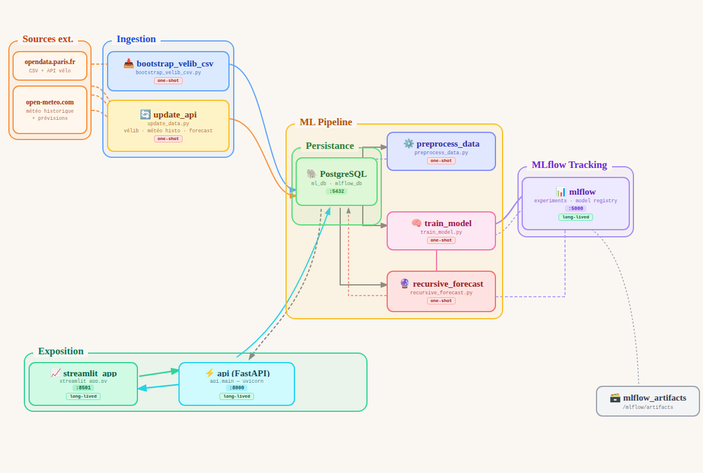

# 🚴 Prediction de l'affluence des vélos dans Paris

## 📑 Sommaire
- [About the project](#ℹ️-about-the-project)
- [Architecture of the project](#🏗-architecture)
- [Features](#️-features)
- [Stack Tech](#-stack-tech)
- [Setup](#️-setup)
- [Have fun!](#-have-fun)
- [About the authors](#-about-the-authors)

---

## 1. 📌 About the project

This project predicts bike-sharing traffic across Paris using data from the **Mairie de Paris Open Data** API and real-time weather data. A **LightGBM Regressor** model is trained on a rich feature set including recursive historical lags, site-level statistics, temporal cycles, weather conditions, and public holiday indicators.

Everything runs inside **Docker** — there is no manual CSV download. The data pipeline bootstraps the database automatically on first run, and all services (database, data pipeline, model training, API, Streamlit, MLflow) are orchestrated via a single `docker compose up`.

The **Streamlit** frontend communicates exclusively through the **FastAPI** backend, which queries **PostgreSQL** and returns predictions and analytics. The API is secured with **JWT authentication** and exposes separate interfaces for `admin` and `client` roles.

---

## 2. 🏗 Architecture of the project

```bash
VELIB/
├── api/                            <- FastAPI application
│   └── main.py                     <- Routes, JWT auth, schemas
│
├── docker/
│   └── postgres/init/              <- SQL initialization scripts
│       ├── 01_create_sites_and_forecast.sql
│       ├── 01-create-mlflow-db.sql
│       └── 02_api_schema.sql
│
├── scripts/                        <- Pipeline entry points (run inside Docker)
│   ├── bootstrap_velib_csv.py      <- Initial data load from Paris Open Data API
│   ├── preprocess_data.py          <- Feature engineering and cleaning
│   ├── recursive_forecast.py       <- 48h recursive forecast generation
│   ├── streamlit_app.py            <- Streamlit entry point
│   ├── train_model.py              <- Model training + MLflow logging
│   └── update_data.py              <- Incremental data update (bike + weather)
│
├── src/
│   ├── data/                       <- Data ingestion and preprocessing
│   │   ├── ingestion.py    
│   │   ├── loader.py
│   │   ├── metadata.py
│   │   └── preprocessing.py
│   ├── db/                         <- Database utilities
│   │   └── db.py
│   └── models/                     <- Model training and inference
│       ├── evaluation.py
│       ├── features.py
│       ├── model_pointer.py
│       ├── model_utils.py
│       ├── predict.py
│       └── train.py
│
├── ui/
│   └── pages/                      <- Streamlit pages
│       ├── analysis.py
│       ├── overview.py
│       └── prediction.py
│
├── utils/
│   └── utils.py
│
├── tests/                          <- Unit tests
│   ├── test_api.py
│   ├── test_features.py
│   ├── test_preprocessing.py
│   ├── test_recursive_forecast.py
│   └── test_train.py
│
├── docker-compose.yml
├── Dockerfile
├── pyproject.toml
├── requirements.txt
└── README.md
```



### 🔄 Data flow
1. `bootstrap_velib_csv` — loads historical bike count data from the Paris Open Data API into PostgreSQL on first run
2. `update_api` — fetches the latest bike counts and weather data (historical + forecast) and updates the DB
3. `preprocess_data` — cleans and engineers features into `velib_weather_processed`
4. `train_model` — trains the LightGBM model and logs experiments to MLflow
5. `recursive_forecast` — generates 48h ahead forecasts stored in the DB
6. **FastAPI** — serves predictions and analytics from the DB, secured with JWT
7. **Streamlit** — displays results by calling the FastAPI endpoints

---

## ⭐️ Features

- 🐳 **Fully dockerized pipeline** — one `docker compose up` bootstraps data, trains the model, generates forecasts, and starts all services
- 🔄 **Automated data ingestion** — bike counts fetched from the Paris Open Data API, weather from Open-Meteo (historical + forecast)
- 🤖 **LightGBM model** — recursive 48h forecasting with lags, rolling stats, temporal features, weather, and holiday indicators
- 🔐 **JWT authentication** — role-based API access (`admin` / `client`) with separate Swagger UIs (`/docs` and `/client-docs`)
- 🗺 **Interactive heatmap** — visualize predicted bike traffic across all Paris sites in Streamlit
- 📈 **Hourly trend charts** — historical + forecast per-site time series with correlation heatmaps
- 📊 **MLflow experiment tracking** — model artifacts, metrics (MAE, RMSE, R²) and runs logged automatically
- 🧪 **Full test suite** — unit tests for data loading, preprocessing, model inference, recursive forecasting, and API endpoints

---

## 🛠 Stack Tech

| Tool | Role |
|---|---|
| **Python 3.10+** | Core language for data processing, training, and prediction |
| **LightGBM** | Machine learning model for regression |
| **FastAPI** | Secured REST API (JWT auth, admin/client roles) |
| **Streamlit** | Interactive web interface for visualization |
| **PostgreSQL 15** | Central database for raw data, processed features, and forecasts |
| **MLflow** | Experiment tracking, model registry, and artifact storage |
| **Docker & Docker Compose** | Full orchestration of all services and pipeline steps |
| **Open-Meteo API** | Historical and forecast weather data |
| **scikit-learn** | Feature pipelines and preprocessing utilities |
| **pytest** | Unit testing framework |

---

## ⚙️ Setup

Make sure you have the following tools installed:
```bash
docker --version
docker compose version
git --version
```

### 1. Clone the repository
```bash
git clone https://github.com/Toine-Dev/Velib
cd Velib
```

### 2. Start all services
```bash
docker compose up --build
```

This single command will automatically:
- Start **PostgreSQL** and initialize the schema
- Run **`bootstrap_velib_csv`** to load historical bike count data from the Paris Open Data API
- Run **`update_api`** to fetch the latest bike and weather data
- Run **`preprocess_data`** to clean and engineer features
- Run **`train_model`** to train the LightGBM model and log results to MLflow
- Run **`recursive_forecast`** to generate 48h forecasts and store them in the DB
- Start **FastAPI**, **Streamlit**, and **MLflow** as persistent services

> ⚠️ The pipeline steps run sequentially and may take a few minutes on first launch depending on the size of the dataset.

### 3. Local access

| Service | URL |
|---|---|
| Streamlit | http://localhost:8501 |
| FastAPI (full docs) | http://localhost:8000/docs |
| FastAPI (client docs) | http://localhost:8000/client-docs |
| MLflow | http://localhost:5000 |

---

## 🎉 Have fun!

### Explore the Streamlit app

Open http://localhost:8501

- **Overview** — project presentation and raw data exploration
- **Data Analysis** — statistical tests and data visualizations
- **Model & Predictions** — predict bike traffic at a given hour, with Paris heatmap and per-site hourly charts


### Call the API directly

The full Swagger UI is available at http://localhost:8000/docs, and a filtered client-only interface at http://localhost:8000/client-docs.

- **1. Create an account**
- **2. Get the available forecast window (next 48h)**
- **3. Get predictions for a specific datetime**
    Returns hourly bike counts for all Paris sites at the given hour.
- **4. Get all forecasts over a time range**
- **5. Get historical + forecast trends for a site**
    Returns a PNG chart with historical data and forecast for a given site.
- **6. Get the correlation heatmap**
    Returns a PNG heatmap of feature correlations (weather, time, holidays vs. bike count).
- **7. Get the historical reference for a site**
    Returns the average bike count for the same day of week and hour over the last 4 weeks.

### Explore MLflow

Open http://localhost:5000 to browse experiment runs, compare metrics (MAE, RMSE, R²), and inspect model artifacts logged during training.

### Run the tests

```bash
pytest
```

Tests cover model loading, feature consistency, recursive forecast behavior, data preprocessing, and FastAPI endpoints (`/client/predict`, `/system/health`, etc.).

---

## 👨‍💻 About the Authors

- **Antoine Scarcella**
- **Nathan Vitse**
- **Nikhil Teja Bellamkonda**